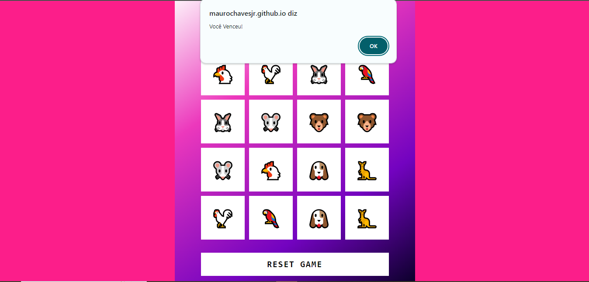

# PROJETO JOGO DA MEMÓRIA

> Projeto foi desenvolvido durante o Bootcamp Potência Tech Ifood - desenvolvimento de jogos, em parceria com a DIO e consiste no desenvolvimento de um jogo da memória, em que o objetivo é adivinhar todas as combinações de cartas iguais.

### Ajustes e melhorias

O projeto está finalizado mas aberto a críticas, elogios e sugestões. As próximas atualizações serão voltadas nas seguintes tarefas:

- [ ] Colocar níveis de jogo
- [ ] Colocar temporizador
- [ ] Acresenctar ranking com os 3 menores tempos

## 💻 Pré-requisitos

Antes de começar, verifique se você atendeu aos seguintes requisitos:

- Um navegador instalado

## ☕ Jogando Jogo da Memória:

Para jogar o jogo da memória siga estas etapas:

- Abra o link: https://maurochavesjr.github.io/jogo-memoria/

## 🤝 Colaboradores

Agradecemos às seguintes pessoas que contribuíram para este projeto:

<table>
  <tr>
    <td align="center">
      <a href="#" title="defina o titulo do link">
         
        
          <b>Mauro Chaves</b>
        
      </a>
    </td>
  </tr>
</table>

